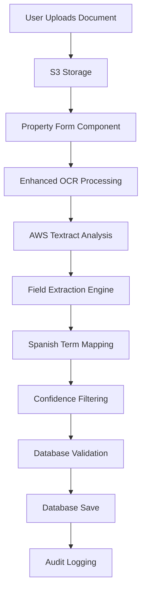

# Enhanced AWS Textract Implementation - Complete Process Explanation

## Table of Contents
1. [Overview](#overview)
2. [Architecture](#architecture)
3. [File Upload Process](#file-upload-process)
4. [OCR Processing](#ocr-processing)
5. [Field Extraction Engine](#field-extraction-engine)
6. [Database Integration](#database-integration)
7. [Code Walkthrough](#code-walkthrough)
8. [Configuration](#configuration)
9. [Monitoring & Debugging](#monitoring--debugging)
10. [Testing & Validation](#testing--validation)

---

## Overview

The Enhanced AWS Textract implementation is a comprehensive system that automatically extracts property and listing data from uploaded documents (PDF, PNG, JPG) and saves the extracted information to the database with confidence-based filtering.

### What It Does
1. **Accepts multiple file formats**: PDF, PNG, JPG images
2. **Extracts structured data**: Uses AWS Textract to identify forms, tables, and text
3. **Maps Spanish terminology**: 100+ property-related Spanish terms mapped to database fields
4. **Validates and filters**: Only saves data with >50% confidence
5. **Provides comprehensive logging**: Detailed logs for debugging and monitoring

### Key Benefits
- **Zero manual data entry** for property information
- **Intelligent field recognition** using fuzzy string matching
- **Confidence-based quality control** ensures data accuracy
- **Comprehensive audit trail** for all operations
- **Fire-and-forget processing** doesn't block the UI

---

## Architecture



### Component Breakdown

| Component | Purpose | Location |
|-----------|---------|----------|
| **Property Form** | User interface for document upload | `src/components/crear/property-identification-form.tsx` |
| **OCR Processor** | AWS Textract integration | `src/server/ocr/ocr-initial-form.tsx` |
| **Field Extractor** | Intelligent data extraction | `src/server/ocr/field-extractor.ts` |
| **Field Mappings** | Spanish terminology configuration | `src/server/ocr/field-mapping-config.ts` |
| **Database Saver** | Data persistence with validation | `src/server/queries/textract-database-saver.ts` |
| **Type Definitions** | TypeScript interfaces | `src/types/textract-enhanced.ts` |

---

## File Upload Process

### Step 1: User Interaction
**Location**: `src/components/crear/property-identification-form.tsx:212-218`

```typescript
// When user uploads a document, this function is called
const handleUpload = async (file: File) => {
  // Upload to S3 and get document key
  const documentKey = await uploadToS3(file);
  
  // Trigger enhanced background processing
  await processDocumentInBackgroundEnhanced(documentKey);
};
```

### Step 2: S3 Storage
- Document is uploaded to AWS S3 bucket
- Generates unique document key (path in S3)
- Returns document key for processing reference

### Step 3: Background Processing Trigger
**Location**: `src/server/ocr/ocr-initial-form.tsx:652-829`

The `processDocumentInBackgroundEnhanced()` function is called with the document key:

```typescript
export async function processDocumentInBackgroundEnhanced(
  documentKey: string,
  bucketName?: string,
): Promise<void>
```

**Key Features:**
- **Non-blocking**: Runs in background without affecting UI
- **Comprehensive logging**: Tracks performance metrics
- **Error handling**: Graceful failure handling
- **Audit trail**: Creates detailed logs for debugging

---

## OCR Processing

### Step 1: AWS Textract Analysis
**Location**: `src/server/ocr/ocr-initial-form.tsx:169-279`

```typescript
export async function analyzeDocumentStructure(
  documentKey: string,
  bucketName?: string,
  enableForms = true,
  enableTables = true,
): Promise<OCRResult>
```

**What Happens:**
1. **Document Retrieval**: Gets document from S3 using document key
2. **Feature Analysis**: Analyzes forms, tables, and layout
3. **Text Extraction**: Extracts all text with confidence scores
4. **Block Organization**: Organizes content into structured blocks

**AWS Textract Features Used:**
- **FORMS**: Detects key-value pairs in forms
- **TABLES**: Extracts tabular data
- **LAYOUT**: Understands document structure

### Step 2: Text Organization
**Location**: `src/server/ocr/ocr-initial-form.tsx:284-334`

The system intelligently organizes extracted text:

```typescript
function extractTextFromBlocks(blocks: Block[]): string {
  // Groups blocks by page
  // Uses layout-aware extraction for better organization
  // Falls back to line-based extraction if needed
}
```

### Step 3: Form Field Detection
**Location**: `src/server/ocr/ocr-initial-form.tsx:355-397`

```typescript
function extractFormFields(blocks: Block[]): Record<string, { text: string; confidence: number }>
```

**Process:**
1. Identifies KEY_VALUE_SET blocks from Textract
2. Pairs keys with their corresponding values
3. Calculates confidence scores for each pair
4. Returns structured form data

---

## Field Extraction Engine

This is the heart of the intelligent data extraction system.

### Overview
**Location**: `src/server/ocr/field-extractor.ts`

The field extraction engine takes raw OCR data and intelligently maps it to database fields using multiple extraction methods.

### Step 1: Multi-Source Extraction
**Location**: `src/server/ocr/field-extractor.ts:368-432`

```typescript
export async function extractEnhancedPropertyData(ocrInput: OCRInput): Promise<{
  extractedFields: ExtractedFieldResult[];
  propertyData: EnhancedExtractedPropertyData;
  listingData: EnhancedExtractedListingData;
  completeData: CompleteExtractedData;
}>
```

**Three Extraction Methods:**

#### 1. Form Field Extraction
**Location**: `src/server/ocr/field-extractor.ts:77-123`

```typescript
function extractFromFormFields(
  detectedFields: Record<string, { text: string; confidence: number }>
): ExtractedFieldResult[]
```

**Process:**
- Takes detected form fields from Textract
- Uses fuzzy string matching to find best field matches
- Applies validation and conversion functions
- Adjusts confidence based on match quality

#### 2. Text Pattern Extraction
**Location**: `src/server/ocr/field-extractor.ts:126-266`

```typescript
function extractFromTextPatterns(extractedText: string): ExtractedFieldResult[]
```

**Process:**
- Uses comprehensive regex patterns for Spanish property terms
- Searches for patterns like "superficie: 120 m2" or "3 dormitorios"
- Estimates confidence based on pattern quality and context
- Handles various Spanish formats and abbreviations

**Example Patterns:**
```typescript
const enhancedPatterns: Record<string, RegExp[]> = {
  price: [
    /(?:precio|valor|importe|coste|costo)\s*:?\s*(\d+(?:[.,]\d{3})*(?:[.,]\d{2})?)\s*€?/i,
    /€\s*(\d+(?:[.,]\d{3})*(?:[.,]\d{2})?)/i,
    /(\d+(?:[.,]\d{3})*(?:[.,]\d{2})?)\s*euros?/i
  ],
  bedrooms: [
    /(?:dormitorios?|habitaciones?|cuartos?|dorm|hab)\s*:?\s*(\d+)/i,
    /(\d+)\s*(?:dormitorios?|habitaciones?|cuartos?)/i
  ]
};
```

#### 3. Table Data Extraction
**Location**: `src/server/ocr/field-extractor.ts:269-343`

```typescript
function extractFromTables(blocks: Block[]): ExtractedFieldResult[]
```

**Process:**
- Identifies TABLE blocks from Textract
- Processes cells as key-value pairs
- Uses fuzzy matching for field identification
- Calculates confidence from cell confidence scores

### Step 2: Fuzzy String Matching
**Location**: `src/server/ocr/field-extractor.ts:26-74`

```typescript
function calculateSimilarity(str1: string, str2: string): number {
  // Uses Levenshtein distance algorithm
  // Normalizes text (removes accents, punctuation)
  // Returns similarity score 0.0-1.0
}
```

**Algorithm Features:**
- **Accent insensitive**: "habitación" matches "habitacion"
- **Partial matching**: "3 dorm" matches "dormitorios"
- **Typo tolerance**: Handles OCR reading errors
- **Confidence scoring**: Better matches get higher confidence

### Step 3: Field Consolidation
**Location**: `src/server/ocr/field-extractor.ts:346-365`

```typescript
function consolidateResults(results: ExtractedFieldResult[]): ExtractedFieldResult[]
```

**Process:**
1. **Deduplication**: Removes duplicate fields from different sources
2. **Confidence ranking**: Keeps highest confidence result for each field
3. **Source prioritization**: Form fields > Tables > Text patterns

---

## Database Integration

### Step 1: Property/Listing ID Resolution
**Location**: `src/server/queries/textract-database-saver.ts:186-247`

```typescript
export async function getPropertyAndListingIds(documentKey: string): Promise<{
  propertyId?: number;
  listingId?: number;
} | null>
```

**Process:**
1. **Extract reference number** from document key using regex
2. **Query database** for property with matching reference number
3. **Find associated listing** for the property
4. **Return IDs** for database operations

**Example Document Key Pattern:**
```
documents/VESTA20240000001/ficha_propiedad/document.pdf
         ↑ Reference Number Extracted Here
```

### Step 2: Data Validation
**Location**: `src/server/queries/textract-database-saver.ts:250-343`

```typescript
export async function validateExtractedData(
  extractedFields: ExtractedFieldResult[]
): Promise<{
  valid: ExtractedFieldResult[];
  invalid: Array<{ field: ExtractedFieldResult; reason: string }>;
}>
```

**Validation Rules:**
- **Type checking**: Ensures numbers are numeric, booleans are boolean
- **Range validation**: Bedrooms 0-10, bathrooms 0-10, year 1800-2030
- **Business logic**: Price must be positive, required fields present
- **Data integrity**: No null/undefined values

### Step 3: Confidence Filtering
**Location**: `src/server/queries/textract-database-saver.ts:42-52`

```typescript
const highConfidenceFields = extractedFields.filter(
  field => field.confidence >= confidenceThreshold // Default: 50%
);
```

**Only fields with ≥50% confidence are saved to database**

### Step 4: Database Save Operation
**Location**: `src/server/queries/textract-database-saver.ts:18-183`

```typescript
export async function saveExtractedDataToDatabase(
  propertyId: number,
  listingId: number,
  extractedFields: ExtractedFieldResult[],
  confidenceThreshold = 50
): Promise<DatabaseSaveResult>
```

**Process:**
1. **Separate data** into property vs listing fields
2. **Build update objects** with proper type conversion
3. **Execute database updates** using existing query functions
4. **Handle errors gracefully** with detailed logging
5. **Return results** with success/failure details

### Step 5: Audit Logging
**Location**: `src/server/queries/textract-database-saver.ts:346-387`

```typescript
export async function createAuditLog(
  documentKey: string,
  propertyId?: number,
  listingId?: number,
  fieldsUpdated?: ExtractedFieldResult[],
  saveResult?: DatabaseSaveResult
): Promise<void>
```

**Audit Information:**
- Timestamp and document details
- Fields processed and saved
- Success/failure status
- Error details if any
- Performance metrics

---

## Code Walkthrough

### File Structure

```
src/
├── types/
│   └── textract-enhanced.ts          # TypeScript definitions
├── server/
│   ├── ocr/
│   │   ├── ocr-initial-form.tsx      # AWS Textract integration
│   │   ├── field-extractor.ts        # Intelligent extraction engine
│   │   └── field-mapping-config.ts   # Spanish field mappings
│   └── queries/
│       └── textract-database-saver.ts # Database persistence
└── components/
    └── crear/
        └── property-identification-form.tsx # UI component
```

### Key Functions and Their Purpose

#### 1. Main Processing Function
**Location**: `src/server/ocr/ocr-initial-form.tsx:652`

```typescript
export async function processDocumentInBackgroundEnhanced(
  documentKey: string,
  bucketName?: string,
): Promise<void>
```

**Purpose**: Orchestrates the entire process from OCR to database save
**Called from**: Property identification form when document is uploaded

#### 2. Field Extraction Entry Point
**Location**: `src/server/ocr/field-extractor.ts:368`

```typescript
export async function extractEnhancedPropertyData(ocrInput: OCRInput): Promise<{
  extractedFields: ExtractedFieldResult[];
  propertyData: EnhancedExtractedPropertyData;
  listingData: EnhancedExtractedListingData;
  completeData: CompleteExtractedData;
}>
```

**Purpose**: Takes OCR results and extracts structured property/listing data
**Returns**: Organized data ready for database save

#### 3. Database Save Function
**Location**: `src/server/queries/textract-database-saver.ts:18`

```typescript
export async function saveExtractedDataToDatabase(
  propertyId: number,
  listingId: number,
  extractedFields: ExtractedFieldResult[],
  confidenceThreshold = 50
): Promise<DatabaseSaveResult>
```

**Purpose**: Validates and saves extracted data to database
**Features**: Confidence filtering, validation, error handling

### Data Flow Example

Let's trace a complete example:

#### 1. User uploads property document
```typescript
// User uploads "ficha_propiedad.pdf" containing:
// - Superficie: 120 m2
// - 3 dormitorios
// - Precio: 350.000€
```

#### 2. OCR Processing
```typescript
// AWS Textract extracts:
{
  extractedText: "Superficie: 120 m2\n3 dormitorios\nPrecio: 350.000€",
  detectedFields: {
    "Superficie": { text: "120 m2", confidence: 95 },
    "Dormitorios": { text: "3", confidence: 89 }
  },
  blocks: [...] // Raw Textract blocks
}
```

#### 3. Field Extraction
```typescript
// Field extractor processes and finds:
[
  {
    dbColumn: "squareMeter",
    dbTable: "properties", 
    value: 120,
    confidence: 95,
    extractionSource: "form",
    matched_alias: "superficie"
  },
  {
    dbColumn: "bedrooms",
    dbTable: "properties",
    value: 3,
    confidence: 89,
    extractionSource: "form", 
    matched_alias: "dormitorios"
  },
  {
    dbColumn: "price",
    dbTable: "listings",
    value: 350000,
    confidence: 85,
    extractionSource: "regex",
    matched_alias: "precio"
  }
]
```

#### 4. Database Save
```typescript
// All fields have >50% confidence, so they're saved:
// Properties table updated: squareMeter=120, bedrooms=3
// Listings table updated: price=350000
```

---

## Configuration

### Spanish Field Mappings
**Location**: `src/server/ocr/field-mapping-config.ts`

This file contains 100+ mappings from Spanish property terms to database columns:

```typescript
export const PROPERTY_FIELD_MAPPINGS: FieldMapping[] = [
  {
    dbColumn: 'bedrooms',
    dbTable: 'properties',
    aliases: ['dormitorios', 'habitaciones', 'cuartos', 'dorm', 'hab', 'alcobas'],
    dataType: 'number',
    validation: isBedroomCount,
    converter: toNumber,
    examples: ['1', '2', '3', '4', '5'],
    category: 'specifications'
  },
  {
    dbColumn: 'squareMeter',
    dbTable: 'properties', 
    aliases: ['superficie', 'metros', 'm2', 'm²', 'metros cuadrados', 'superficie útil'],
    dataType: 'number',
    validation: isPositiveNumber,
    converter: toNumber,
    category: 'specifications'
  }
  // ... 100+ more mappings
];
```

### Field Mapping Structure

Each mapping contains:
- **dbColumn**: Target database column name
- **dbTable**: Target table (properties or listings)
- **aliases**: Spanish terms that map to this field
- **dataType**: Expected data type (string, number, boolean, decimal)
- **validation**: Optional validation function
- **converter**: Optional conversion function
- **examples**: Example values for documentation
- **category**: Logical grouping for organization

### Validation Functions
**Location**: `src/server/ocr/field-mapping-config.ts:11-45`

```typescript
const isPositiveNumber = (value: string): boolean => {
  const num = parseFloat(value);
  return !isNaN(num) && num > 0;
};

const isBedroomCount = (value: string): boolean => {
  const count = parseInt(value);
  return !isNaN(count) && count >= 0 && count <= 10;
};
```

### Converter Functions
**Location**: `src/server/ocr/field-mapping-config.ts:47-65`

```typescript
const toNumber = (value: string): number => {
  return parseFloat(value.replace(/[^\d.,]/g, '').replace(',', '.'));
};

const toBoolean = (value: string): boolean => {
  const normalizedValue = value.toLowerCase().trim();
  return ['sí', 'si', 'yes', 'true', '1', 'x', '✓', 'tiene', 'incluye'].includes(normalizedValue);
};
```

---

## Monitoring & Debugging

### Comprehensive Logging System

The system provides detailed logging at every step for debugging and monitoring:

#### Performance Metrics
**Location**: `src/server/ocr/ocr-initial-form.tsx:671-676`

```typescript
performanceMetrics: {
  ocrDuration: 0,           // Time spent on OCR
  extractionDuration: 0,    // Time spent on field extraction  
  databaseDuration: 0,      // Time spent on database operations
  totalDuration: 0          // Total processing time
}
```

#### Processing Logs
**Location**: Throughout `src/server/ocr/ocr-initial-form.tsx:795-813`

```typescript
console.log(`🎯 [OCR-ENHANCED] Enhanced processing completed successfully:`);
console.log(`   📊 Performance Metrics:`);
console.log(`      - Total duration: ${log.performanceMetrics.totalDuration}ms`);
console.log(`      - OCR confidence: ${log.ocrConfidence.toFixed(1)}%`);
console.log(`      - Fields extracted: ${log.fieldsExtracted}`);
console.log(`      - Fields saved: ${log.fieldsSaved}`);
```

#### Field-Level Logging
**Location**: `src/server/ocr/field-extractor.ts:118`

```typescript
console.log(`✅ [EXTRACTION] Form field match: "${fieldKey}" → ${mapping.dbColumn} (${similarity.toFixed(2)} similarity, ${fieldData.confidence.toFixed(1)}% confidence)`);
```

#### Database Operation Logging
**Location**: `src/server/queries/textract-database-saver.ts:110-112`

```typescript
Object.entries(propertyUpdateData).forEach(([key, value]) => {
  const field = propertyFields.find(f => f.dbColumn === key);
  console.log(`   └─ ${key}: ${String(value)} (source: ${field?.extractionSource}, confidence: ${field?.confidence.toFixed(1)}%)`);
});
```

### Log Message Prefixes

The system uses consistent prefixes for easy log filtering:

- `🚀 [OCR-ENHANCED]`: Main processing flow
- `🔍 [EXTRACTION]`: Field extraction operations
- `💾 [DATABASE]`: Database operations
- `⚠️ [OCR-ENHANCED]`: Warnings
- `❌ [OCR-ENHANCED]`: Errors
- `✅ [EXTRACTION]`: Successful operations

### Debugging Tips

#### 1. Track Processing Flow
Search logs for document key to see complete processing flow:
```bash
grep "VESTA20240000001" application.log
```

#### 2. Monitor Field Extraction
Filter extraction logs to see what fields were found:
```bash
grep "\[EXTRACTION\]" application.log | grep "match:"
```

#### 3. Check Database Operations
Monitor what was actually saved:
```bash
grep "\[DATABASE\]" application.log | grep "field prepared"
```

#### 4. Performance Analysis
Track processing times:
```bash
grep "Performance Metrics" application.log
```

---

## Testing & Validation

### Manual Testing Process

#### 1. Upload Test Documents
Create test documents with known property data:

```
Test Document Content:
- Superficie: 85 m2
- 2 dormitorios  
- 1 baño
- Precio: 280.000€
- Orientación: Sur
- Con ascensor
- Garaje incluido
```

#### 2. Monitor Logs
Watch the processing logs to see:
- OCR confidence levels
- Fields extracted and matched
- Validation results
- Database save operations

#### 3. Verify Database
Check that extracted data was saved correctly:

```sql
-- Check property updates
SELECT * FROM properties WHERE reference_number = 'VESTA20240000001';

-- Check listing updates  
SELECT * FROM listings WHERE property_id = (
  SELECT property_id FROM properties WHERE reference_number = 'VESTA20240000001'
);
```

### Validation Scenarios

#### High Confidence Scenario
```
✅ Expected: Data is extracted and saved
- Clear, typed document
- Standard Spanish terminology
- Good image quality
- Confidence > 50%
```

#### Low Confidence Scenario
```
⚠️ Expected: Data is extracted but not saved
- Handwritten document
- Poor image quality
- Non-standard terminology
- Confidence < 50%
```

#### Mixed Confidence Scenario
```
🔄 Expected: Only high-confidence fields saved
- Some fields clear (saved)
- Some fields unclear (not saved)
- Partial database update
```

### Common Issues and Solutions

#### Issue: No Fields Extracted
**Symptoms**: Log shows 0 fields extracted
**Causes**: 
- Document language not Spanish
- No recognizable property terms
- Poor OCR quality

**Solutions**:
- Check OCR confidence levels
- Verify document contains Spanish property terms
- Improve document image quality

#### Issue: Fields Extracted but Not Saved
**Symptoms**: Fields extracted but fieldsSaved = 0
**Causes**:
- All confidence scores < 50%
- Validation failures
- Database connection issues

**Solutions**:
- Lower confidence threshold for testing
- Check validation rules
- Verify database connectivity

#### Issue: Wrong Field Values
**Symptoms**: Incorrect data in database
**Causes**:
- OCR misreading
- Incorrect field mapping
- Validation not catching errors

**Solutions**:
- Improve field validation rules
- Add more specific regex patterns
- Enhance fuzzy matching algorithm

---

## Advanced Features

### Fuzzy String Matching Algorithm

The system uses Levenshtein distance for intelligent field matching:

**Location**: `src/server/ocr/field-extractor.ts:26-58`

```typescript
function calculateSimilarity(str1: string, str2: string): number {
  // Text normalization
  const normalize = (s: string) => s.toLowerCase()
    .normalize('NFD')
    .replace(/[\u0300-\u036f]/g, '') // Remove accents
    .replace(/[^\w\s]/g, '')         // Remove punctuation
    .trim();

  const a = normalize(str1);
  const b = normalize(str2);

  // Exact match
  if (a === b) return 1.0;
  
  // Substring match
  if (a.includes(b) || b.includes(a)) return 0.8;

  // Levenshtein distance calculation
  // Returns similarity score 0.0-1.0
}
```

**Benefits**:
- Handles typos and OCR errors
- Accent-insensitive matching
- Substring matching for abbreviations
- Confidence-based scoring

### Multi-Source Data Extraction

The system extracts data from three sources and consolidates results:

1. **Form Fields**: Highest priority, most accurate
2. **Table Data**: Medium priority, structured data
3. **Text Patterns**: Lowest priority, fallback method

**Consolidation Logic**:
```typescript
// Keep highest confidence result for each field
const consolidatedMap = new Map<string, ExtractedFieldResult>();
const sortedResults = results.sort((a, b) => b.confidence - a.confidence);

for (const result of sortedResults) {
  const key = `${result.dbTable}.${result.dbColumn}`;
  if (!consolidatedMap.has(key)) {
    consolidatedMap.set(key, result);
  }
}
```

### Confidence-Based Quality Control

The system only saves data above a confidence threshold:

```typescript
// Default threshold: 50%
const highConfidenceFields = extractedFields.filter(
  field => field.confidence >= confidenceThreshold
);

if (highConfidenceFields.length === 0) {
  console.log(`⚠️ [DATABASE] No fields meet confidence threshold. Skipping database save.`);
  return; // No data saved
}
```

**Confidence Calculation**:
- **Form fields**: OCR confidence × field match similarity
- **Text patterns**: Base confidence + context bonuses
- **Table data**: Minimum of key/value cell confidences × match similarity

---

## Future Enhancements

### Potential Improvements

1. **Machine Learning Integration**
   - Train custom models on Spanish property documents
   - Improve field recognition accuracy
   - Learn from user corrections

2. **Advanced Validation**
   - Cross-field validation (e.g., price vs. size consistency)
   - Historical data comparison
   - Market value validation

3. **UI Enhancements**
   - Real-time extraction preview
   - Manual field correction interface
   - Confidence visualization

4. **Performance Optimizations**
   - Parallel processing for multiple documents
   - Caching for repeated extractions
   - Optimized regex patterns

### Configuration Expansion

1. **Additional Languages**
   - English property terminology
   - Catalan real estate terms
   - Multilingual support

2. **Custom Field Mappings**
   - User-defined field mappings
   - Dynamic pattern configuration
   - Regional terminology variations

3. **Enhanced Validation**
   - Custom validation rules
   - Business logic validation
   - External API validation

---

## Conclusion

The Enhanced AWS Textract implementation provides a robust, intelligent system for extracting property data from documents. Key strengths include:

- **Comprehensive Spanish support** with 100+ field mappings
- **Multi-source extraction** for maximum data coverage
- **Intelligent field matching** with fuzzy string algorithms
- **Quality control** through confidence-based filtering
- **Detailed logging** for debugging and monitoring
- **Type-safe implementation** with full TypeScript support

The system is production-ready and can significantly reduce manual data entry while maintaining high data quality standards.